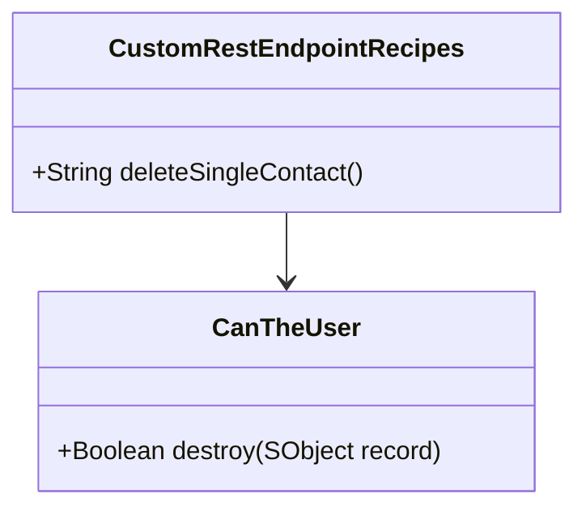
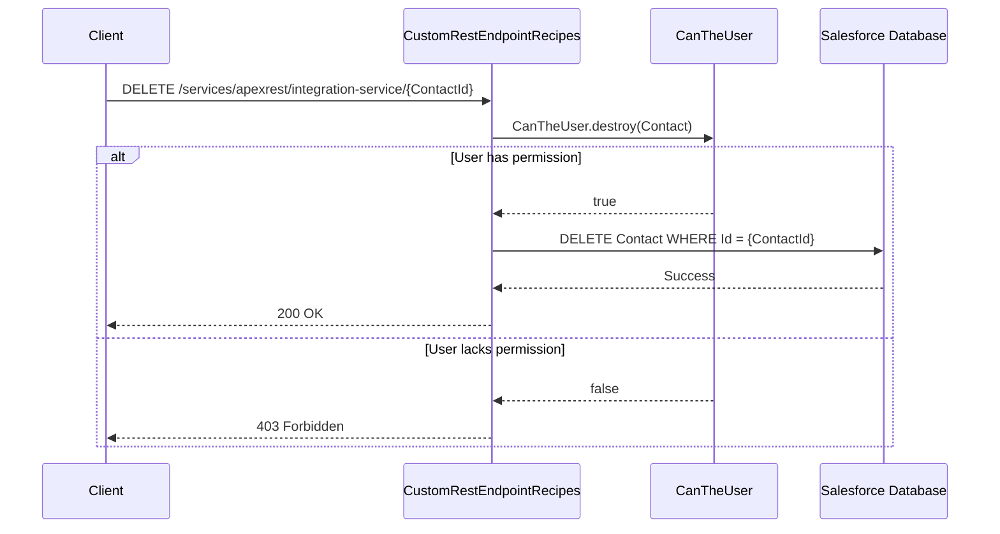

// user story used for code generation

Contact Record Deletion via REST API

As a user, I want to delete Contact records using a custom REST API endpoint, so that I can remove unnecessary contact data.

Technical Requirements

The implementation of the Contact Record Deletion via REST API should adhere to the following technical requirements:

1. Architecture Considerations
   - Utilize the existing `CustomRestEndpointRecipes` class to define the REST API endpoint.
   - Ensure the endpoint is annotated with `@HttpDelete` to handle DELETE HTTP requests.

2. Involved Modules/Classes
   - `CustomRestEndpointRecipes` class: Define the `deleteSingleContact` method.
   - `CanTheUser` utility class: Perform CRUD/FLS permission checks.

3. Relevant Interfaces or Methods
   - `deleteSingleContact`: Method to handle the deletion logic.
   - `CanTheUser.destroy`: Method to validate user permissions for deleting Contact records.

4. Database Schema Changes
   - No changes to the database schema are required.

5. Validations
   - Validate the presence of the Contact ID in the request.
   - Ensure the user has the necessary permissions to delete the Contact.
   - Handle exceptions such as `QueryException` and `DmlException` gracefully.

6. Integration Points
   - Integration with the Salesforce database to perform the deletion operation.
   - Integration with external systems for API requests and responses.

7. Error Handling
   - Return a 403 error if the user lacks permissions.
   - Return a 400 error for invalid request formats.
   - Return a 500 error for server-side issues.
   - Return a 200 status code upon successful deletion.

UML Diagram

Sequence Diagram

